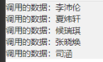

## 1.获取数据库的全部信息
```javascript
data: {
    dbresult:''
}
//START 云函数
wx.cloud.callFunction({
  name: 'database',//云函数接口名称database
  data: {//向接口传递参数'user'，'user'为数据库名称，另一个数据库名为'drawing'
    database: 'user',
  },
  success: res => {
    //wx.showToast调用成功提示，可删除
    wx.showToast({
      title: '调用成功',
    })
    console.log(res.result.data)//打印数据库的全部信息
    this.setData({
      dbresult: res.result.data
    })
  },
  fail: err => {
    //wx.showToast调用成功提示，可删除
    wx.showToast({
      icon: 'none',
      title: '调用失败',
    })
    console.error('[云函数] [database] 调用失败：', err)
  }
})
//END
```
```html
<!-- wxml部分 如何调用数据 -->
<view wx:for="{{dbresult}}">
  <!-- item.[字段]获取信息 -->
  <text>调用的数据：{{item.username}}</text>
</view>
```
