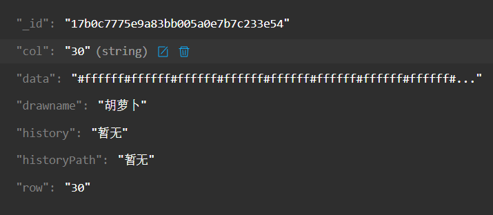

## 2.数据上传至数据库
```javascript
//js部分
data: {
  drawname:'',//画的名称
  row:'',//行
  col:'',//列
  data:'',//画的数据
  history:'',//历史数据
  historyPath:'',//历史视频路径
}
//单独传一个参数实例
dname:function(e){
  var aka = e.detail.value;//前端传过来的值
  console.log(aka)
},
//传递全部参数
subData:function(e){
  var subdata = e.detail.value;//获取前端传过来的值
  this.setData({
    drawname:subdata.drawname,
         row:subdata.row,
         col:subdata.col,
        data:subdata.data,
     history:subdata.history,
 historyPath:subdata.historyPath,
})
console.log("[提交画的数据]",e)
//START 云函数
wx.cloud.callFunction({
  name: 'upload',//云函数接口名称upload
  data: {//向接口传递的参数
    drawname:this.data.drawname,
         row:this.data.row,
         col:pthis.data.col,
        data:this.data.data,
     history:pthis.data.history,
 historyPath:this.data.historyPath,
},
success: res => {
  wx.showToast({
    title: '提交成功',
  })
},
fail: err => {
  wx.showToast({
    icon: 'none',
    title: '调用失败',
  })
  console.error('[云函数] [upload] 调用失败：', err)
}
})
//END
}
```
```html
//wxml部分 如何传递数据（这里使用的form表单，画的名称写了传一个值的方法仅供参考）
<form bindsubmit='subData'>
  <input type='text' bindinput='dname' name='drawname' placeholder='画的名称'/>
  <input type='text' name='row' placeholder='行'/>
  <input type='text' name='col' placeholder='列'></input>
	<input type='text' maxlength="9999999999999" name='data' placeholder='图画'></input>
	<input type='text' maxlength="9999999999999" name='history' placeholder='历史'></input>
	<input type='text' maxlength="9999999999999" name='historyPath' placeholder='历史视频'></input>
  <button formType="submit">传数据库</button>
</form>
```


