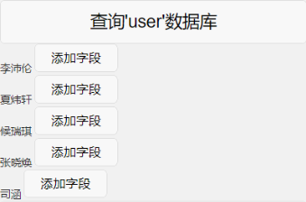
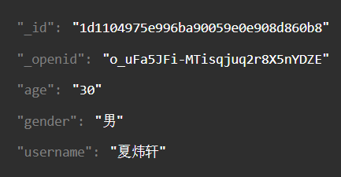
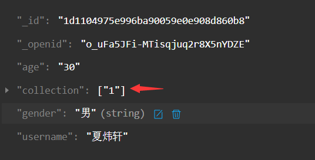
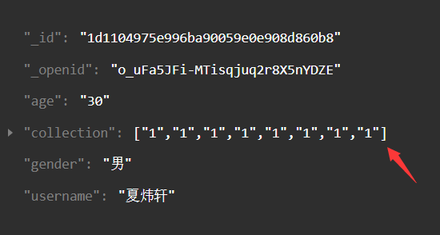

## 3.给数据项添加字段（用于，作品、收藏、DIY）
例子：
先获取数据库，给其中一项添加字段
```html
<button bindtap="onQuery">查询'user'数据库</button>
<view wx:for="{{queryResult}}">
    <view wx:if="{{item._id}}">
        {{item.username}}
        <button size="mini" data-test='1' data-id='{{item._id}}' bindtap="ziDuan">添加字段</button>
	</view>
</view
```
```javascript
//查询数据库函数，简易写的
data: {
    queryResult: '',
},
onQuery: function() {
    wx.cloud.callFunction({
        name: 'database',//云函数接口
        data: {
            database: 'user',
        },
        success: res => {
            this.setData({
                queryResult: res.result.data
            })
        },
    })
}
```

给夏炜轩添加字段 我写的一个测试值添加‘1’
```javascript
ziDuan:function(e){
    console.log(e.currentTarget.dataset.test)//这里传的值用1代替
    //START 云函数
    wx.cloud.callFunction({
        name: 'addcollection',//云函数接口
        //云函数名称
        //addworks 作品
        //addcollection 收藏
        //adddiy（DIY）
        data: {//传递的数据
            database: 'user',//'user'数据库 （必填
            _id:e.currentTarget.dataset.id,//需要添加字段的id（必填
            diy:e.currentTarget.dataset.test,//传画的数据
            works:e.currentTarget.dataset.test,//传画的数据
            collection:e.currentTarget.dataset.test//传画的数据
            //diy works collection向哪个接口传数据用哪个变量
        },
        success: res => {
            wx.showToast({
                title: '添加成功',
            })
        },
        fail: err => {
            wx.showToast({
                icon: 'none',
                title: '调用失败',
            })
            console.error('[云函数] [add--] 调用失败：', err)
        }
    })
    //END
},
```
原始数据：

添加字段后：

多次添加字段后：
