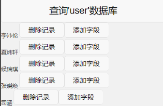
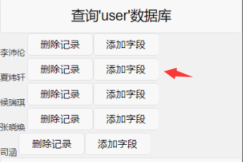
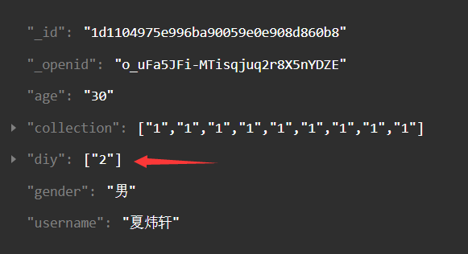
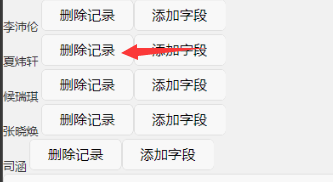
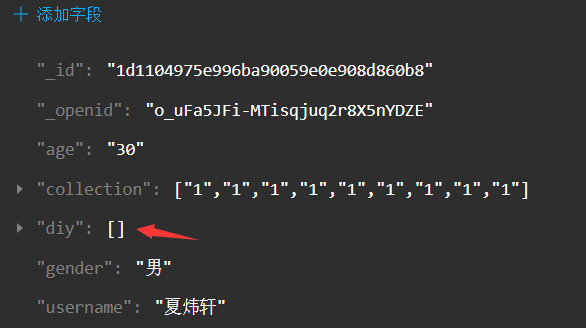

## 4.删除数组字段中某一数据项（用于，作品、收藏、DIY）
例子：
先获取数据库，给其中一项添加字段，再删除
```html
<button bindtap="onQuery">查询'user'数据库</button>
<view wx:for="{{queryResult}}">
    <view wx:if="{{item._id}}">
        {{item.username}}
        <button size="mini" data-test='2' data-id='{{item._id}}' bindtap="onRemove">删除记录</button>
        <button size="mini" data-test='2' data-id='{{item._id}}' bindtap="ziDuan">添加字段</button>
	</view>
</view
```
```javascript
//查询数据库函数，简易写的
data: {
    queryResult: '',
},
onQuery: function() {
    wx.cloud.callFunction({
        name: 'database',//云函数接口
        data: {
            database: 'user',
        },
        success: res => {
            this.setData({
                queryResult: res.result.data
            })
        },
    })
}
```

给夏炜轩添加字段 我写的一个测试值添加‘2’
再点击按钮可删除
```javascript
onRemove: function(e) {
    console.log(e.currentTarget.dataset.id)//获取点击行的id
    if (e.currentTarget.dataset.id) {
        wx.cloud.database()
        .collection('user')//进入user数据库
        .where({
            _id: e.currentTarget.dataset.id//查找固定id对应的数据
        })
        .get({
            success: res => {
                for(var i=0;i<res.data.length;i++){
                    for(var j=0;j<res.data[i].diy.length;j++){//diy、collection、works可相互替换
                        if(res.data[i].diy[j]==e.currentTarget.dataset.test){//diy、collection、works可相互替换，删除测试值'2'，从前端获取
                            res.data[i].diy.splice(j,1)//diy、collection、works可相互替换
                            wx.cloud.callFunction({
                                name: 'ddiy',//云函数接口：ddiy、dcollection、dworks可相互替换
                                data: {
                                    diy:res.data[i].diy,//diy、collection、works可相互替换
                                },
                                success: res => {
                                    wx.showToast({
                                        title: '提交成功',
                                    })
                                },
                                fail: err => {
                                    console.error('[云函数] [d--] 调用失败：', err)
                                }
                            })
                        }
                    }
                }
            },
            fail: err => {
                console.error('[数据库] [删除记录] 失败：', err)
            }
        })
    }else {
        wx.showToast({
            title: '无记录可删，请见创建一个记录',
        })
    }
},
```
先添加字段



字段添加成功



再点击删除记录



记录删除


